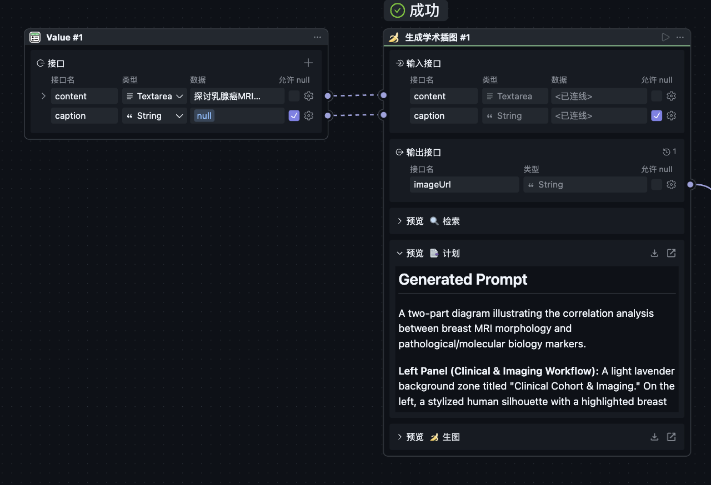

# PaperBanana 🍌

Based on [PaperBanana](https://github.com/dwzhu-pku/PaperBanana)'s `dev_planner`
mode, i.e. Retrieve → Plan → Visualize.

The output image can be below expectation. You can tweak the image later with
the "edit" block.

## Credits

The [dataset](https://huggingface.co/datasets/dwzhu/PaperBananaBench) and
prompts are from the original PaperBanana repo.

## Project Overview

PaperBanana automates academic illustration generation for AI scientists. It transforms research content into publication-ready diagrams through an intelligent pipeline combining retrieval, planning, and visualization.

## Block Capabilities

- **Retriever**: Searches curated diagram collections to find visually similar references for guiding illustration generation
- **Planner**: Translates research content into detailed visual prompts using in-context learning from reference diagrams
- **Visualizer**: Generates scientific illustrations from text prompts using state-of-the-art image generation models
- **Editor**: Modifies existing images based on text instructions using AI-powered editing capabilities
- **Generate (Subflow)**: End-to-end academic illustration pipeline combining retrieve, plan, and visualize blocks

## Block Combination Suggestions

1. **Full Pipeline**: Use Generate subflow for automated end-to-end illustration from research content
2. **Manual Pipeline**: Chain Retriever → Planner → Visualizer for step-by-step control
3. **Iterative Refinement**: Generate → Editor for fine-tuning outputs that need adjustments
4. **Reference-Based**: Use Retriever output to guide Planner for consistent visual style

## Basic Usage

1. Provide research content describing mechanisms, processes, or findings
2. Optionally add a caption for additional context
3. Run the Generate subflow or individual blocks in sequence
4. Review and edit the generated illustration if needed

## Examples

**Example 1: Mechanism Diagram**
- Input: "Research on thyroid medullary carcinoma mechanisms showing PGC-1α expression, PROS1 acetylation, and tumor-macrophage interaction via PROS1/MERTK"
- Output: Publication-ready mechanism diagram with normal vs. cancer cell comparison

**Example 2: Process Flow**
- Input: "Single-cell sequencing workflow from sample collection through clustering analysis to pathway enrichment"
- Output: Visual workflow diagram showing each analysis step

**Example 3: Image Editing**
- Input: Generated image URL + prompt "Add labels for key cellular components"
- Output: Updated diagram with annotated labels

## License

MIT.
